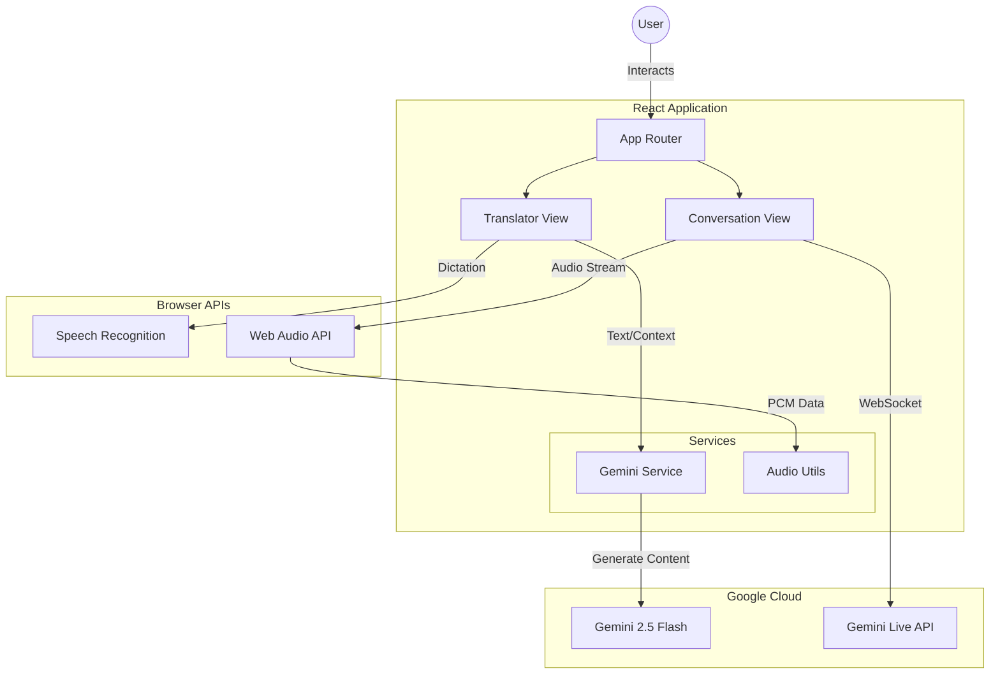
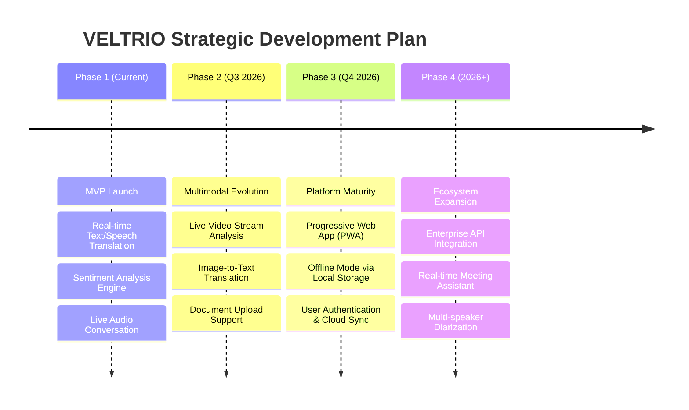

# VELTRIO 🌐

**AI‑Powered Real‑time Translation, Sentiment Analysis & Voice AI**

VELTRIO is a modern web application built to remove language barriers by combining real‑time translation, sentiment analysis, and interactive AI voice conversations. Powered by Google’s **Gemini 2.5 Flash** models, it delivers not only accurate translations but also meaningful insight into the emotional tone behind communication.

---

## 🔗 Overview

VELTRIO enables users to communicate seamlessly across languages while understanding *how* something is said, not just *what* is said. The platform supports text, speech, and live AI‑driven voice conversations, wrapped in a polished, responsive user experience.

---

## 🛡️ Badges


---

## ✨ Core Features

### 🗣️ Smart Translator

* Multi‑modal input with text and real‑time speech recognition
* Automatic language detection based on browser settings
* Instant sentiment analysis (Positive, Neutral, Negative) with contextual explanation
* Text‑to‑Speech playback with adjustable speed (0.5×–2×)
* Local translation history for quick reference

### 🎙️ Live AI Conversation

* Low‑latency, bidirectional voice‑to‑voice interaction with Gemini Live
* Real‑time transcription for both user input and AI responses
* Dynamic visual indicators for listening, speaking, and connection states

### 🎨 User Experience

* Dark and Light mode with smooth transitions
* Glassmorphism‑inspired UI using gradients and backdrop blur
* Mobile‑first, fully responsive design

---

## 🧠 Technology Stack

**Frontend**

* React 19
* TypeScript
* Tailwind CSS

**AI & Audio**

* Google GenAI SDK (`@google/genai`)
* Gemini Models:

  * `gemini-2.5-flash` – Translation & Sentiment Analysis
  * `gemini-2.5-flash-native-audio-preview-09-2025` – Live Audio Streaming
* Web Audio API (raw PCM streaming, AudioContext)

**Tooling**

* Vite (Build Tool)

---

## 🏗️ Architecture Highlights

* **Singleton AI Client** for efficient Gemini SDK usage
* Structured JSON outputs for reliable sentiment validation
* Custom audio pipeline with Float32 ↔ Int16 PCM conversion
* State‑driven voice conversation lifecycle (idle → connecting → active → error)
* Gapless audio playback queue for natural AI responses

  ### System Architecture




## 📁 Project Structure

```
src/
├── components/        # UI components & views
├── services/          # Gemini API integration logic
├── utils/             # Audio & helper utilities
├── types.ts           # Shared TypeScript types
├── constants.ts       # Configuration constants
├── App.tsx            # Application shell & routing
└── main.tsx           # Entry point
```

---

## 🚀 Getting Started

### Prerequisites

* Node.js v18 or higher
* Google GenAI API Key

### Installation

```bash
git clone https://github.com/yourusername/veltrio.git
cd veltrio
npm install
```

### Environment Configuration

Create a `.env` file in the project root:

```env
API_KEY=your_google_genai_api_key_here
```

Ensure your bundler exposes this key as `process.env.API_KEY`.

### Run Development Server

```bash
npm run dev
```

## Product Roadmap



### Phase Breakdown

*   **Phase 1: MVP Launch (Completed)**
    *   Core translation engine using Gemini 2.5 Flash.
    *   Sentiment analysis with visual feedback.
    *   Bidirectional voice chat using Gemini Live API.

*   **Phase 2: Multimodal Evolution**
    *   Integration of video stream input for visual context translation using Gemini's multimodal capabilities.
    *   Support for uploading images for text extraction and translation.
    *   Live camera integration for sign language or object detection translation.

*   **Phase 3: Platform Maturity**
    *   **PWA**: Converting the app into a Progressive Web App for installability on mobile and desktop.
    *   **Offline Mode**: Caching translation models or history for use without internet access.
    *   **User Accounts**: Implementation of Firebase or Supabase for cross-device history synchronization.

*   **Phase 4: Ecosystem Expansion**
    *   **Meeting Assistant**: Real-time transcription and summary of multi-person meetings.
    *   **Diarization**: Distinguishing between different speakers in the Live Conversation mode.

## 👥 Team

| Name            | Role                       | Responsibility                                                |
| --------------- | -------------------------- | ------------------------------------------------------------- |
| **Arjun S N**   | Lead Developer & Architect | System architecture, state management, Gemini SDK integration |
| **Aravindan K** | AI Integration Specialist  | Gemini Live API, raw PCM audio streaming, speech pipeline     |
| **Godfrey T R** | Frontend Engineer & UI/UX  | Responsive UI, landing page, sentiment visualization          |

---

## 📄 License

This project is licensed under the **MIT License**. See the `LICENSE` file for details.

---

© 2025 **VELTRIO**. All rights reserved.
